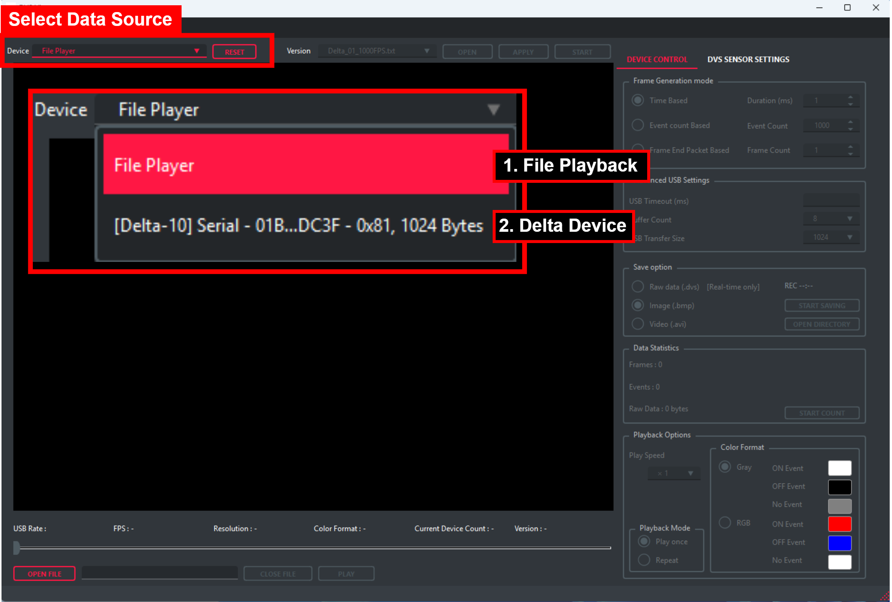
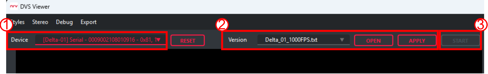
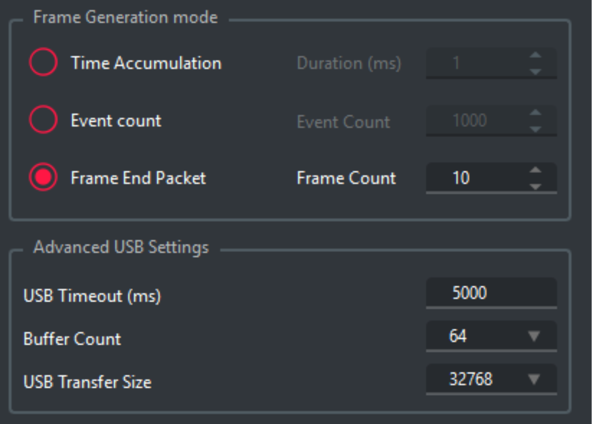
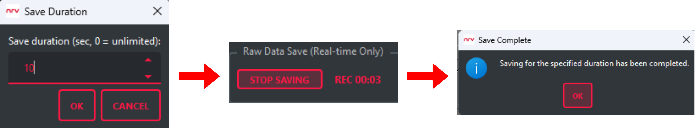
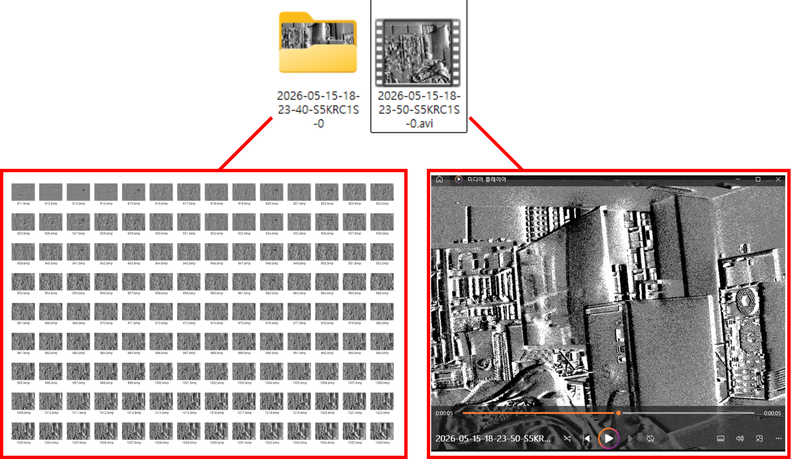
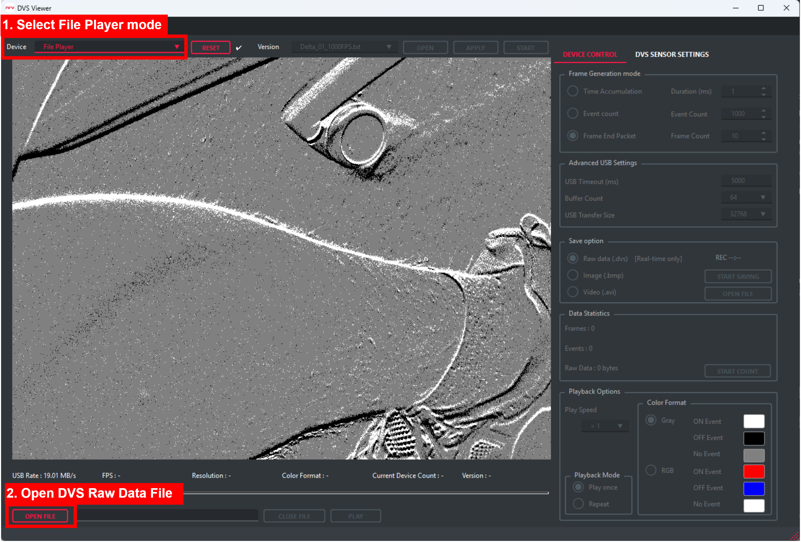
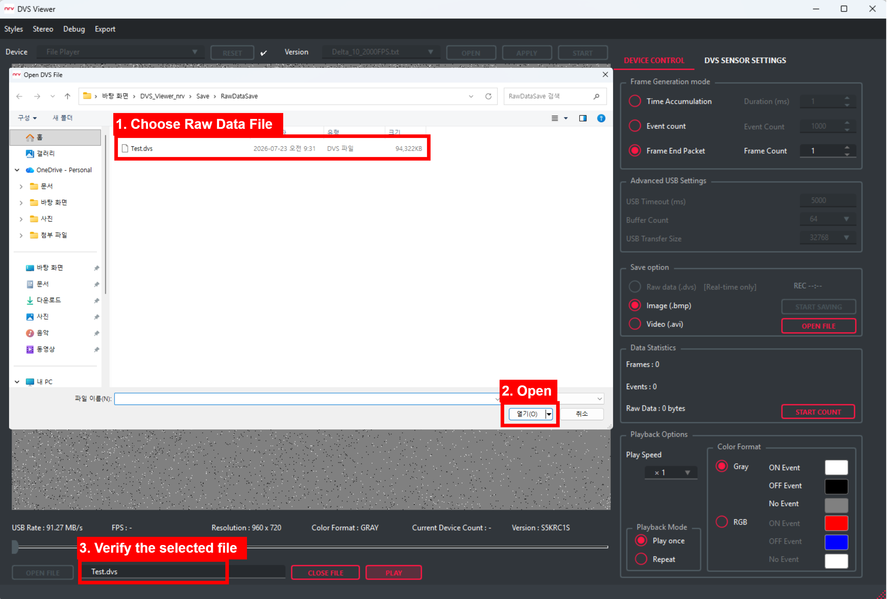
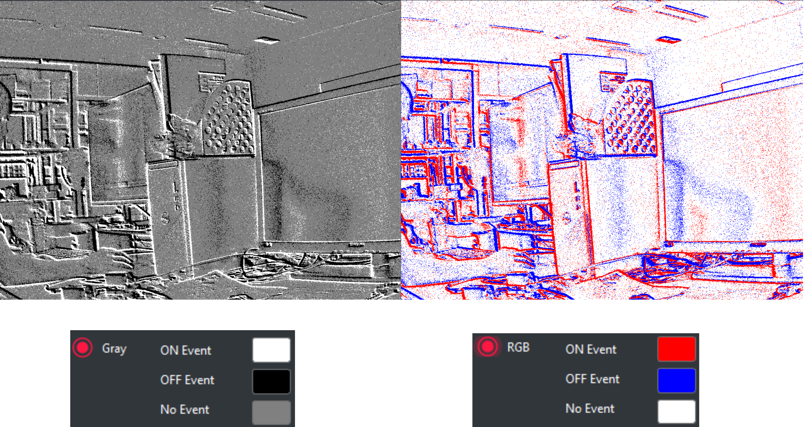

# DVS Viewer

DVS Viewer is an application designed to make it easy and convenient to use the Delta Series event cameras developed by Neuro Reality Vision (NRV). It provides essential features for working with the cameras, including real-time streaming, event data visualization, data recording, and playback.

For more information about the internal operation of DVS Viewer and the camera control APIs, please refer to the [NRV SDK documentation](https://nrvcorp.github.io/docs/software/get_started/).

## Environment Setup

For Windows environments, see:

- [DVS Viewer for Windows](Windows/x64/README.md)

For Linux environments, see:

- [DVS Viewer for Linux](Linux/x64/README.md)

## Viewer Guide

### Select a Data Source

After launching DVS Viewer, first select the source from which data will be loaded. Use the **Device** drop-down menu to play previously recorded data or stream live data from a connected Delta camera.



**1. File Playback Mode**

File Player is selected by default. This mode allows you to open and view previously recorded event data without connecting a camera.

For detailed instructions, see [File Playback guide](#3-file-playback).

**2. Device Live Streaming Mode**

When a Delta camera is properly connected to the host system, it appears in the **Device** list together with its device information.

Device information is displayed in the following format:

```text
[Delta-XX] Serial - <Serial Number> - <USB Endpoint>, <Packet Size>
```

The fields indicate the following:

- `Delta-XX`: The connected Delta camera model
- `Serial Number`: The unique serial number of the camera
- `0x81`: The USB endpoint address used for data streaming
- `1024 Bytes`: The maximum USB transfer packet size

Some cameras have a serial number programmed into the device, while others do not. If a camera without a serial number is connected via USB, it will be identified by its USB hub/port ID. **The absence of a displayed serial number does not indicate an error**

After selecting the connected camera, see the [Live Streaming guide](#1-live-streaming) for instructions on starting a live stream.

### Before You Start

If the operation does not work as expected, check the checkbox status.

If an X mark is displayed, an error occurred during the button operation. Restart the software or reset the camera, then follow the guide again from the beginning.

If a check mark is displayed, the operation has been completed successfully.

If the viewer still does not operate correctly, please contact : contact@nrv.kr

## 1. Live Streaming

To use live streaming, the DVS camera must first be connected by USB and recognized by the system.

If the device is not recognized, complete the [environment setup](#environment-setup) for your operating system first.

The full live streaming procedure is shown below.



In the Settings panel, apply the setting file that matches the device, then verify that the checkbox displays a check mark.

When a camera is selected, the appropriate settings for that camera are loaded automatically. Simply click the Apply button to apply them.

- `Delta_01_1000FPS.txt`: 1000 Frame Rate Setting (Delta-01 Only)
- `Delta_10_2000FPS.txt`: 2000 Frame Rate Setting (Delta-10 Only)

**Caution: Applying a settings file whose camera name does not match the selected camera may cause an error. If an error occurs, disconnect and reconnect the camera’s USB cable.**

When the sensor settings are applied, the application checks the device’s internal information in the background and collects a small amount of data to verify that it is being output correctly. If the data is successfully verified, the information below is displayed along with the “Setup completed” message.

Click the Start button to begin streaming.

> [!NOTE]
> Before starting, you can configure the Frame Generation Mode settings. These settings cannot be changed while streaming is running. To change them, click the Stop button to pause streaming, update the settings, and then click Start again to view the image data with the updated settings.



**Frame Generation Mode**
- `Time Accumulation`: Generates one sub-frame from events accumulated over the specified duration.
- `Event Count`: Generates one sub-frame whenever the specified number of events has accumulated.
- `Frame End Packet`: Generates one sub-frame based on the Frame End Packet signal produced by the DVS sensor.

**Advanced USB Settings (Normally No Changes Required)**
- `USB Timeout`: Sets the USB timeout duration. A timeout occurs if no data is received from the USB device within this period.
- `Buffer Count`: Sets the number of internal buffers used to store raw data received via USB. Increasing this value may help when a large amount of data arrives in a short period.
- `USB Transfer Size`: Sets the amount of data retrieved from USB in a single transfer.

For more information about Frame Generation Mode, refer to the API documentation in the [NRV SDK documentation](https://nrvcorp.github.io/docs/software/get_started/).


## 2. Save DVS Data

DVS Viewer provides two data saving modes.

1. Save raw data before parsing. [Raw data can be saved only during live streaming]

2. Save images generated after parsing and applying the Frame Generation settings. [It can be saved during both live streaming and file playback.]

Select the desired saving mode, then click the Start Saving button to begin saving.

To open the folder containing the saved data, click the Open File button.



### 2.1 Save Raw Data

When the Save Duration window appears, enter the duration you want to save. If you enter `0`, saving continues until you click the Stop Saving button.

The REC area on the right displays how many seconds the data has been recording.

When saving is complete, the Save Complete window appears. The raw data is saved as a `.dvs` file in the `RawDataSave` folder. This `.dvs` file can later be opened in [File Playback](#3-file-playback) mode.

Saved raw data can also be converted to the HDF5 (.h5) format. For more information, see [Export DVS Data](#5-export-DVS-data).

### 2.2 Save Images or Videos

`Save Images` are saved as individual sub-frames generated according to the selected Frame Generation Mode.

`Save Videos` are created by combining these generated images at a frame rate of 16 frames per second (FPS).

As shown in the image below, the saved files are stored in the `MatSave` folder.



## 3. File Playback

You can run File Playback mode by selecting a saved raw data file or one of the provided test data files.

To use File Playback, first change the device selection to File Player.

Then, click the Open File button. File Explorer will open the `RawDataSave` folder.



Select the `.dvs` file you want to open, then click the Open button. The selected file will be loaded in the viewer. Verify that the selected file name matches the file that was actually opened.



Before playing the file, you can select the Playback Options.

- Play Speed: Adjusts the file playback speed (`×1`, `×1/2`, `×1/4`, `×1/8`, or `×1/16`)

- Playback Mode: Selects whether the file is played once or continuously in a loop.

- Color Format: Configures how events are displayed.
   `Gray` : ON events are white, OFF events are black, and areas with no events are gray. [These colors cannot be changed]
   `RGB`  : By default, ON events are red, OFF events are blue, and areas with no events are white. [Each color can be customized]



### 3-1. Data Statistics

Data Statistics provides statistical information about a raw data file, including the number of frames and events, as well as the event data size. In File Playback mode, statistics are collected automatically during playback and reset to zero when the entire file has finished playing.

This feature can also be used during `Live Streaming` by clicking the `Start Count button`. 

However, it is not recommended because collecting statistics during live streaming may cause a data bottleneck. In File Playback mode, statistics are collected automatically without any additional action.

## 4. Sensor Register Control

After the sensor settings have been applied to a Delta camera, the DVS Sensor Settings Panel on the right side of the screen becomes enabled. This panel provides various controls for configuring the DVS sensor.


#### 1. Sensitivity

Adjusts the thresholds for ON and OFF events generated by the DVS sensor.

- Moving toward `Very High` lowers the thresholds, causing more events to be generated.

- Moving toward `Very Low` raises the thresholds, reducing the number of generated events.

#### 2. External Trigger Mode

Controls the DVS sensor using an external trigger signal.

Changing this setting without an external trigger signal may prevent the camera from operating. Make sure that an external trigger signal is connected before changing the mode.

- `Not Used` : Operates the sensor using its internal clock without an external trigger. This is the default mode.

- `Single` : Generates one frame for each external trigger signal.

- `Burst` : Uses the external trigger as a start signal and then operates continuously according to the internal clock settings.

- `Burst Single` : Generates the number of frames specified by Frame Width for each external trigger signal.

#### 3. Frame Rate

Controls the frame rate of the DVS sensor. The frame rate can be adjusted in increments of 50 FPS, and the maximum supported FPS varies by camera model.

The default sensor settings applied during Live Streaming are configured for the maximum FPS supported by each camera. A lower FPS can then be selected based on that maximum value.

- `Delta-01` : 100–1,000 FPS

- `Delta-10` : 100–2,000 FPS

#### 4. Global Setting

Global Setting controls the sensor’s event acquisition and data-freezing timing using Global Reset and Global Hold.

- `Global Reset` : Initializes the sensor’s internal state before the next event acquisition period begins.

- `Global Hold` : Freezes the sensor’s event state or data updates during the Data Freezing period, allowing consistent frame-based data output.

Global Reset must be completed before the Global Hold Data Freezing period begins.

Reset Delay determines when Global Reset occurs. As the Delay value increases, Global Reset moves closer to the beginning of the Data Freezing period. The valid range is calculated automatically based on the current sensor timing and displayed under Range.

Enter a hexadecimal value within the valid range in Delay (hex). The converted time is displayed on the right in microseconds (µs). After confirming the value, click Apply to apply the setting to the sensor.

**Caution: Values outside the displayed range cannot be applied. Unless required for a specific purpose, using the default value is recommended**

#### 5. Data Format

This is a feature specific to NRV DVS sensors. The default format is `MGROUP`. It determines how sensor data is formatted for output and normally does not need to be changed unless required for a specific use case.

#### 6. Control Sensor Register

Provides direct control over sensor registers that are not covered by the settings above. Through I²C communication, you can fine-tune individual sensor registers, perform Read-Back Tests to verify that settings were applied correctly, and access other advanced sensor controls.

## 5. MenuBar

#### 1. Styles 

Use this menu to select the Viewer’s UI theme. Dark Mode is enabled by default, but you can switch to Light Mode at any time.

#### 2. Stereo

This menu is reserved for upcoming stereo camera products, including the Stereo Delta Camera (dual DVS sensors) and the Delta-Sigma Camera (DVS + CIS).

#### 3. Debug

The Debug menu allows you to receive and inspect one data packet at a time instead of using continuous streaming. It provides detailed information about frame, column, and event data.

This feature is unavailable while streaming is active. To use it:

1. Apply the sensor settings and ensure that streaming is stopped.

2. Click Read 1 Buffer to receive 65,504 bytes of raw data.

3. Click Parsing to parse the raw data and display it in a user-friendly format.

#### 4. Export

The Export menu converts `.dvs` raw data into a commonly used large-scale event-data format.

Select the `.dvs` file to convert under Raw File, then specify the destination path and output filename under Save File.

Currently, only `HDF5 (*.h)` output is supported. Additional export formats will be added in future releases.

Click Export to begin the conversion. You can monitor its status using the progress bar.

#### 5. Calibration

The Calibration menu opens the integrated DVS Calibration workflow for capturing and reviewing circle-grid samples and calculating mono or stereo camera parameters.

When Calibration is selected, DVS Viewer asks for confirmation. Selecting **Yes** stops active saving and streaming, releases the connected camera and USB resources, closes the Viewer window, and restarts the same `DVS_Viewer` program in Calibration mode. Calibration then detects the connected camera again and applies its calibration sensor settings.

Calibration settings are stored under `calibration/settings`. Captured sessions and generated calibration results are stored under `calibration/data`.

Before switching modes, allow any active file save operation to finish when possible. Do not disconnect the camera while Viewer is closing or Calibration is detecting and configuring the sensor.

## 6. Contact

If you have any questions about the Viewer or encounter any issues, please contact us at `contact@nrv.kr`.