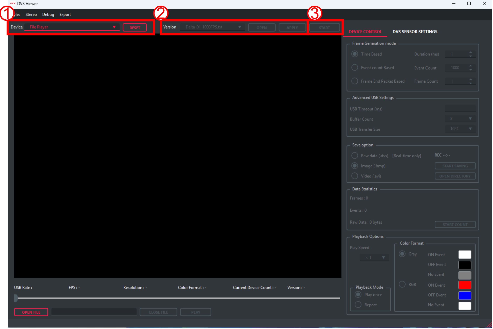
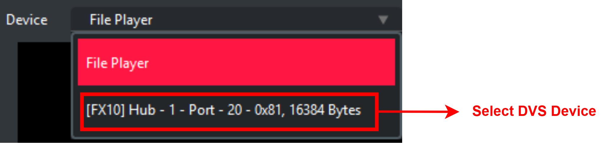
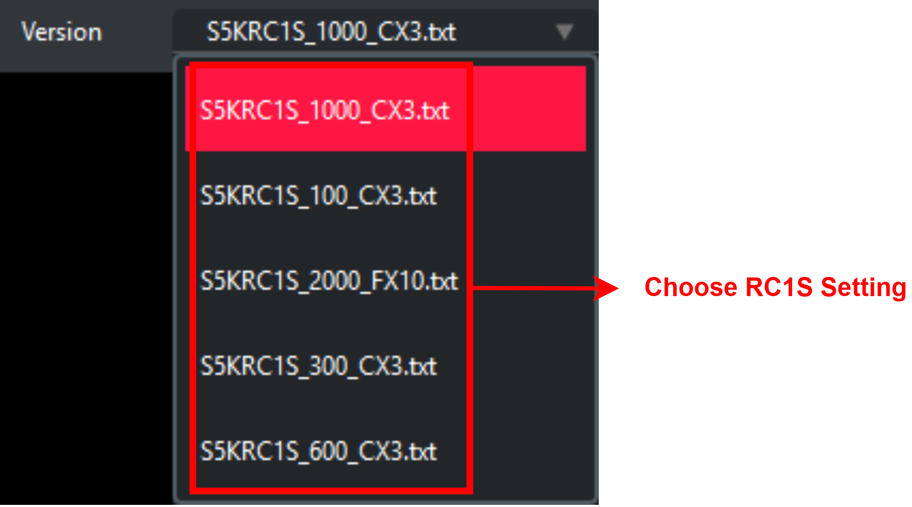
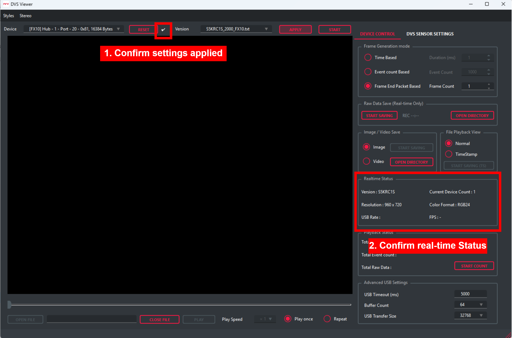
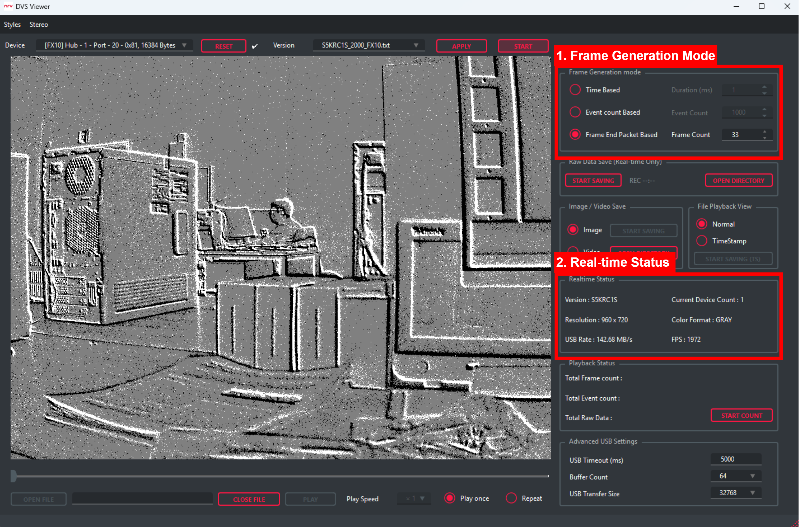
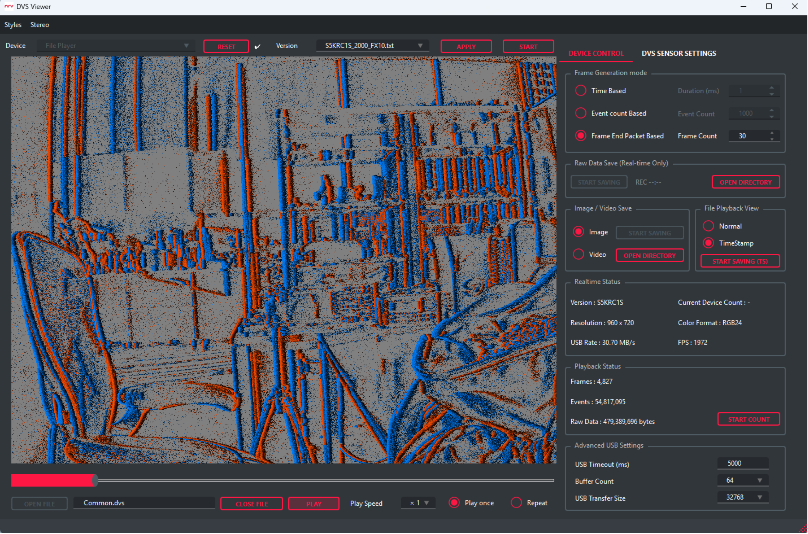
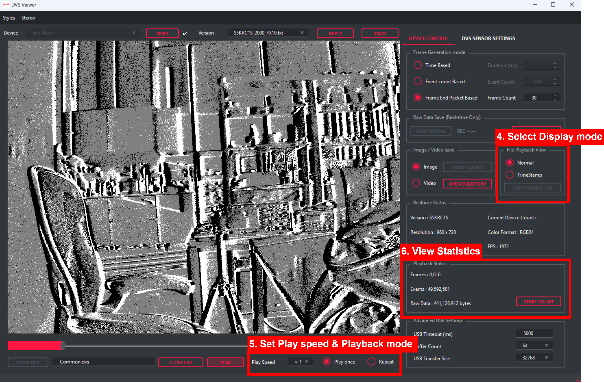

# DVS Viewer

DVS Viewer is an application designed to make it easy and convenient to use the Delta Series event cameras developed by Neuro Reality Vision (NRV). It provides essential features for working with the cameras, including real-time streaming, event data visualization, data recording, and playback.

For more information about the internal operation of DVS Viewer and the camera control APIs, please refer to the [NRV SDK documentation](https://nrvcorp.github.io/docs/software/get_started/).

## Environment Setup

For Windows environments, see:

- [DVS Viewer for Windows](Windows/x64/README.md)

For Linux environments, see:

- [DVS Viewer for Linux](Linux/x64/README.md)

## Viewer Guide

### Select a Data Source

After launching DVS Viewer, first select the source from which data will be loaded. Use the **Device** drop-down menu to play previously recorded data or stream live data from a connected Delta camera.


**1. File Playback Mode**

File Player is selected by default. This mode allows you to open and view previously recorded event data without connecting a camera.

For detailed instructions, see [File Playback guide](#3-file-playback).

**2. Device Live Streaming Mode**

When a Delta camera is properly connected to the host system, it appears in the **Device** list together with its device information.

Device information is displayed in the following format:

```text
[Delta-XX] Serial - <Serial Number> - <USB Endpoint>, <Packet Size>
```

The fields indicate the following:

- `Delta-XX`: The connected Delta camera model
- `Serial Number`: The unique serial number of the camera
- `0x81`: The USB endpoint address used for data streaming
- `1024 Bytes`: The maximum USB transfer packet size

After selecting the connected camera, see the [Live Streaming guide](#1-live-streaming) for instructions on starting a live stream.

### Before You Start

If the operation does not work as expected, check the checkbox status.

If an X mark is displayed, an error occurred during the button operation. Restart the software or reset the camera, then follow the guide again from the beginning.

If a check mark is displayed, the operation has been completed successfully.

If the viewer still does not operate correctly, please contact : contact@nrv.kr

## 1. Live Streaming

To use live streaming, the DVS camera must first be connected by USB and recognized by the system.

If the device is not recognized, complete the [environment setup](#environment-setup) for your operating system first.

The full live streaming procedure is shown below.



In the Device selection panel, select the device you want to use.

   If an `RC1S_CX3` camera is connected, the device name is prefixed with `[CX3]`. If an `RC1S_FX10` camera is connected, the device name is prefixed with `[FX10]`.



In the Settings panel, apply the setting file that matches the device, then verify that the checkbox displays a check mark.



RC1S_CX3 settings:

- `S5KRC1S_100_CX3.txt`: 100 Frame Rate Setting
- `S5KRC1S_300_CX3.txt`: 300 Frame Rate Setting
- `S5KRC1S_600_CX3.txt`: 600 Frame Rate Setting (Recommended)
- `S5KRC1S_1000_CX3.txt`: 1000 Frame Rate Setting

RC1S_FX10 settings:

- `S5KRC1S_2000_FX10.txt`: 2000 Frame Rate Setting (Recommended)

If the setting is applied successfully, a check mark should be displayed as shown below. The Realtime Status panel should also display `Version: S5KRC1S`, `Current Device Count`, `Resolution`, and `Color Format` information.



Click the Start button to begin streaming.

> [!NOTE]
> Before starting, you can configure the Frame Generation Mode settings. These settings cannot be changed while streaming is running. To change them, click the Stop button to pause streaming, update the settings, and then click Start again to view the image data with the updated settings.



While the RC1S camera is streaming in real time, you can check the incoming USB data speed (`USB Rate`) and the number of frames generated by the sensor per second (`FPS`).

## 2. Save DVS Data

DVS Viewer provides two data saving modes.

1. Save raw data before parsing.

2. Save images or videos generated after parsing and applying the Frame Generation settings.

Both save modes are available while streaming is running.

Refer to [Live Streaming](#1-live-streaming) first, then proceed with data saving.

### 2.1 Save Raw Data


In the Device Control panel, click the Start Saving button in the Raw Data Save section.

When the Save Duration window appears, enter the duration you want to save. If you enter `0`, saving continues until you click the Stop Saving button.

The REC area on the right displays how many seconds the data has been recording.

When saving is complete, the Save Complete window appears. The raw data is saved as a `.dvs` file in the `RawDataSave` folder. This `.dvs` file can later be opened in [File Playback](#3-file-playback) mode.

### 2.2 Save Images or Videos

While live streaming is running, select the desired mode in the Image/Video Save section of the Device Control Panel, then click the Start Saving button. The data will be saved in the selected mode.

As shown in the image below, the saved files are stored in the `MatSave` folder.


## 3. File Playback

You can run File Playback mode by selecting a saved raw data file or one of the provided test data files.

To use File Playback, first change the device selection to File Player.

Then, click the Open File button. File Explorer will open the `RawDataSave` folder.


Select the `.dvs` file you want to open, then click the Open button. The selected file will be loaded in the viewer. Verify that the selected file name matches the file that was actually opened.


Before playing the file, you can select the File Playback View.

- `Normal`: Plays the file using pixel polarity information.
- `TimeStamp`: Plays the file using pixel timestamp information.

When TimeStamp mode is selected, the viewer appears as shown below.



This mode may not display correctly if it is changed while the file is playing. Make sure to select the view mode before starting playback.

> [!IMPORTANT]
> To change the view mode, close the file with Close File, open it again with Open File, and then select the desired mode.

You can also configure the playback speed and choose between Play Once and Repeat. These settings can be changed while the file is playing.

In File Playback mode, the viewer counts the number of frames, the number of events, and the total data size during playback. This information helps users debug saved data.



> [!NOTE]
> Frame Generation Mode is compatible with both [Live Streaming](#1-live-streaming) and [File Playback](#3-file-playback).

## 4. Sensor Register Control [In Progress]

In the DVS Sensor Setting panel, you can modify DVS sensor values in real time through I2C and immediately check the resulting changes in the live image.

Initially, the values from the applied setting file are entered. You can control these values and observe how the image changes. Detailed information for each register will be improved in a future update. For now, please use this section as a reference for real-time sensor control.