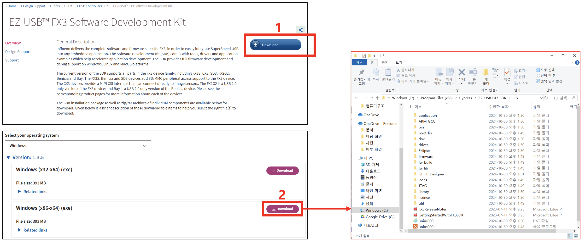
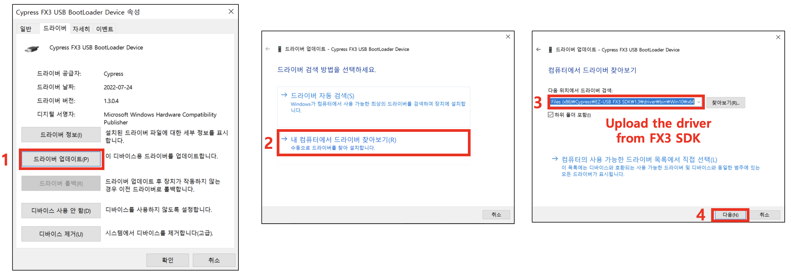
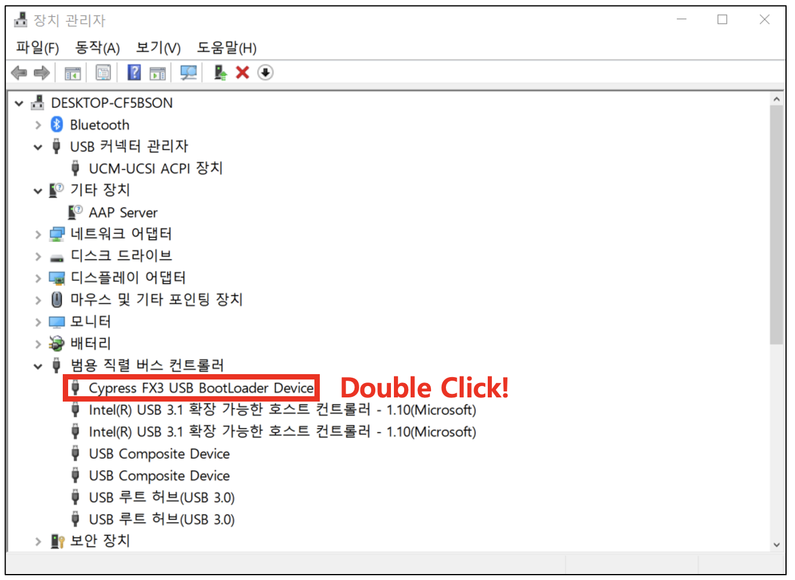

# DVS Viewer for Windows

DVS Viewer is a Windows application for real-time streaming from NRV hardware cameras, including `RC1S_CX3` and `RC1S_FX10`.

The viewer can display live DVS data, save unparsed raw data, save parsed frame images, record video output, and play back previously saved DVS data.

## Environment Setting

To connect a DVS device on Windows, the Cypress USB driver must be installed.

This release package already includes the required runtime files, including Qt runtime DLLs, OpenCV DLLs, and the DVS SDK DLL. Keep the included files and folders in the same directory as `DVS_Viewer_FX20.exe`.

## Installing Drivers

1. Download and install the Infineon EZ-USB FX3 SDK.

   [EZ-USB FX3 Software Development Kit](https://www.infineon.com/cms/en/design-support/tools/sdk/usb-controllers-sdk/ez-usb-fx3-software-development-kit/)

   

2. Connect the USB camera to the PC.

3. Open Device Manager and find the connected `CX3` or `FX10` device.

4. Update the driver manually.

   

5. Select the Cypress USB driver from the installed FX3 SDK driver folder.

   

> [!NOTE]
> If the DVS device is recognized with the default Windows driver, such as WinUSB, remove the device from Device Manager first. When removing it, select **Delete the driver software for this device**, then update the device again using the FX3 SDK driver.

## How to Run

Connect the DVS device to the PC by USB, then run:

**Windows PowerShell**

```powershell
cd Windows\x64
.\DVS_Viewer_FX20.exe
```
